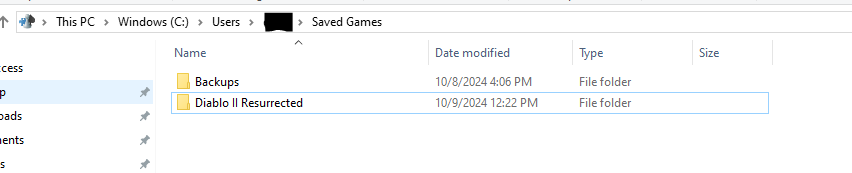
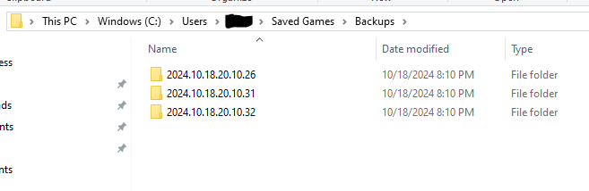

# Diablo II: Resurrected Single Player Backup

A script to backup all your Diablo II: Resurrected single player characters.

## Motivation

I was working on my single player holy grail when the power went out and one of my character files became corrupted. This also corrupted the shared stash that is used by all single player characters.

After being unable to restore the character, I wrote this script to help prevent this problem in the future.

I was able to rebuilt my character using another tool but I really didn't like how long that took.

## What it does

When the script runs it gets the machine's current time and the username that is running the script. It will copy all the files from a source directory to a target directory.

It will copy all the files in the `C:\Users\<username>\Saved Games\Diablo II Resurrected` folder into the `C:\Users\<username>\Saved Games\Backup\<current_time>` folder.

Here is an example of the created `Backup` folder.

Here is an example of the folders that are created in the `Backup` folder.

Each of these backup folders has all the characters that were in the source directory at the time of the backup.

## How to install and run

- Install Python 3

Use the following command to run this script:

`python backup.py`

The script uses Python. It was tested on Python 3.10+ and uses only standard libraries so it should work with most versions of Python 3.