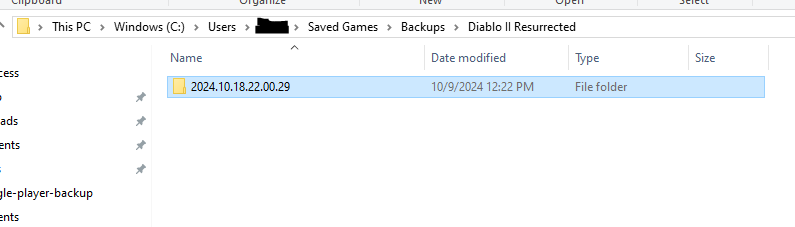

# Diablo II: Resurrected Single Player Backup

A script to backup all your Diablo II: Resurrected single player characters.

## Motivation

I was working on my single player holy grail when the power went out and one of my character files became corrupted. This also corrupted the shared stash that is used by all single player characters.

I tried looking online for an automated way to restore the character and the shared stash. After many searches and many obscure form posts, I was unable to restore the character and stash in an automated fashion. I was able to rebuild my character using another tool but I really didn't like how long that took.

I want to save myself and others from the same experience. I wrote this script as a way to backup all my characters after each gameplay session.

I wanted it to be very simple and not use any 3rd party libraries. It uses a simple configuration file and vanilla Python.

## What it does

It will copy all the files in the `C:\Users\<username>\Saved Games\Diablo II Resurrected` folder into the `C:\Users\<username>\Saved Games\Backup\<current_time>` folder.

**You can override these settings in a `config.json` file.** You can read about this in the [Configuration section](#configuration)

When you navigate to the `Backups\Diablo II Resurrected` folder, you will see a folder with a timestamp as the name. It will have all your single player characters in it.

**Please note:** logging into Battle Net also causes your online characters' `.ctlo` files to get downloaded. I am not completely sure what these files do but I think it has information like name, level and what gear is equipped so that it can display your character on the character selection page.

This script, by default, will prune those `.ctlo` files from previous backups. 

## How to install and run

- Install Python 3

Navigate to the directory with the backup.py script and run the following command:

`python backup.py`

The backup.py script was tested on Python 3.10+ and uses only standard libraries so it should work with most versions of Python 3.

## Configuration

If you want to change the default **source**, **destination**, **timestamp_format** or **prune** settings, you can create a `config.json` file. Store the file in the same directory you run the backup.py script in. The `config.json.example` file has been provided to make this easier and provide an example for you.

### Configuration Settings

| parameter  | description  | default value |
| ---------- | ------------ | ------------- |
| **source** | Where the single player character files are stored. | The windows location of `C:\Users\<my_user>\Saved Games\Backups` |
| **destination** | Where the backup will be located when the script runs. | The windows location of `C:\Users\<my_user>\Saved Games\Diablo II Resurrected` with the **timestamp_format** parameter below appended to this path. |
| **timestamp_format** | A timestamp using the Python strftime format codes. You can read about them [here](https://docs.python.org/3/library/datetime.html#strftime-and-strptime-format-codes). | The code uses `%Y.%m.%d.%H.%M.%S`. If the backup script was ran on exactly April 11th, 2025 at 2:34pm the output would be `2025.04.11.14.34.00` |
| **prune** | When set to true, the backup.py script will go through all previous backups and remove the `.ctlo` files. These files are used by online characters. When these files are deleted, they are downloaded again by the game. They take up extra space in the backup folders so they get pruned. | true |
